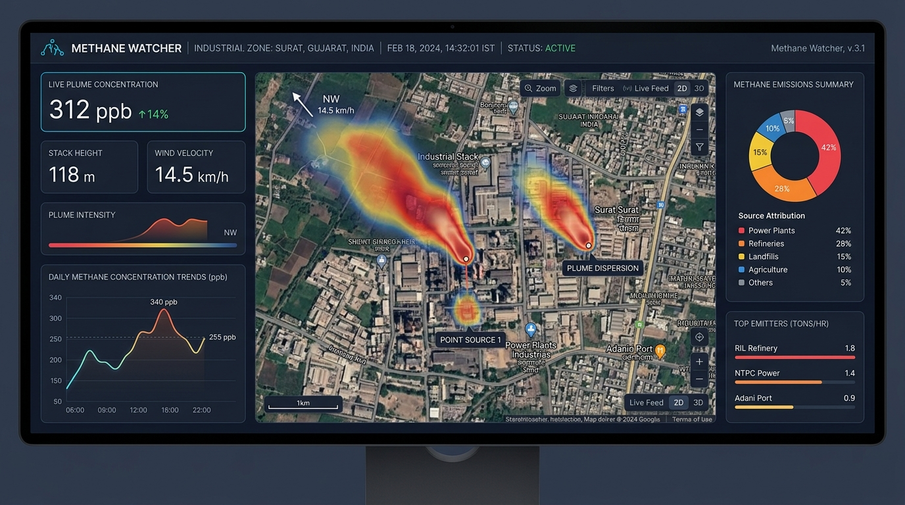
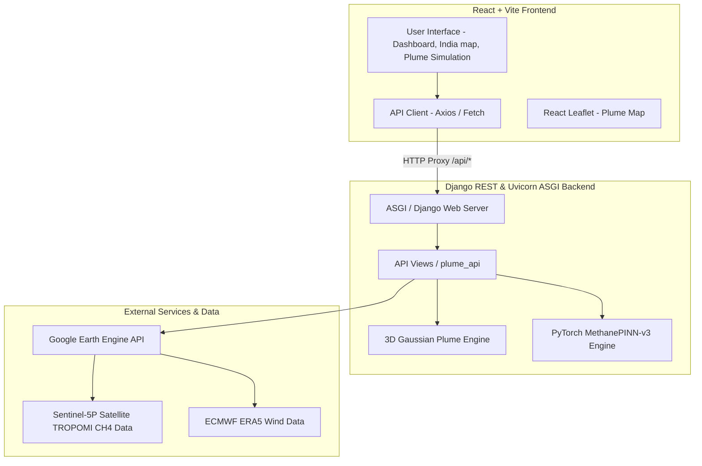

# 🛰️ Methane Watcher: AI-Powered Satellite Methane Monitoring & PINN Plume Modeling Platform

[](https://www.python.org/)
[](https://www.djangoproject.com/)
[](https://pytorch.org/)
[](https://react.dev/)
[](https://vitejs.dev/)
[](https://earthengine.google.com/)

**Methane Watcher** is an end-to-end, real-time satellite methane ($\text{CH}_4$) emission monitoring and atmospheric dispersion forecasting platform. By combining high-resolution **Sentinel-5P TROPOMI** satellite observations via **Google Earth Engine (GEE)** with a **Physics-Informed Neural Network (MethanePINN)**, the system enables automated leak detection, 3D Gaussian plume dispersion modeling, source attribution back-trajectories, and retrospective live forecast validation.

---

## 📊 Dashboard Visualization

Here is a visual overview of the Methane Watcher monitoring dashboard:



---

## 🌟 Key Capabilities

- **🛰️ Live Sentinel-5P Ingestion**: Direct connection to Google Earth Engine's `COPERNICUS/S5P/OFFL/L3_CH4` dataset for global and regional methane monitoring.
- **🧠 Physics-Informed Neural Network (MethanePINN)**: Deep learning dispersion model trained with physics loss constraints integrating Pasquill-Gifford atmospheric stability and Briggs plume rise mechanics.
- **🇮🇳 India National Dashboard**: Focused satellite monitoring across high-emission industrial clusters (ONGC oil fields, LNG terminals, coal fields, refineries, and offshore rigs).
- **🌬️ 3D Gaussian Plume Simulation**: Interactive 2D/3D plume visualization computing spatial concentration gradients ($\text{ppb}$), effective stack heights, and dispersion widths ($\sigma_y, \sigma_z$).
- **📍 Source Attribution & Back-Trajectory**: Backward Lagrangian trajectory tracer that pinpoints upwind emission sources and identifies nearby industrial facilities.
- **📊 Retrospective Forecast Validation**: Autonomous tracking of predictions against future satellite passes to quantify uncertainty and detect distribution shifts over time.
- **🛡️ 38-Point Diagnostic Verification Suite**: Automated end-to-end validation script checking GEE access, dataset isolation, model checksums, and unit audits.

---

## 🏗️ Architecture & Data Pipelines

### System Architecture
The application runs on a split-stack architecture, where a React SPA connects to a Django ASGI backend running PyTorch deep learning models.



### Data Processing Pipeline
The data flow describes the path from raw Sentinel-5P measurements on Google Earth Engine to simulated plumes on the user's dashboard:

```mermaid
flowchart LR
    S5P[Sentinel-5P TROPOMI] --> GEE[Google Earth Engine API]
    GEE --> Fetch[fetch_satellite_image.py]
    Fetch --> Preprocess[Feature Scalers / scalers.py]
    Preprocess --> PINN[PyTorch MethanePINN Model]
    PINN --> Output[Methane Concentration Predictions]
    Output --> Dispersion[3D Gaussian Plume Simulation]
    Dispersion --> FrontendMap[Interactive UI Maps & Charts]
```



---

## 📂 Repository Structure

```text
methane-watcher-main/
├── django_backend/               # Core Python Django Backend & ML Engine
│   ├── data/                     # Persistent storage for datasets & models
│   │   ├── models/               # Model checkpoints (pinn_methane_v3.pt) & cards
│   │   ├── satellite/            # Raw & processed satellite GeoTIFF rasters
│   │   └── training/             # S5P-INDIA-REAL-v2 dataset & audit reports
│   ├── methane_watcher/          # Django project settings & ASGI configuration
│   ├── ml/                       # Machine Learning Pipeline
│   │   ├── baselines.py          # 5-Model benchmark leaderboard & ablation tests
│   │   ├── constants.py          # Feature names (12 features), dimensions, & paths
│   │   ├── dataset.py            # Real Sentinel-5P dataset generator & loader
│   │   ├── gaussian_plume.py     # Atmospheric dispersion & Briggs plume physics
│   │   ├── inference.py          # MethanePINN prediction pipeline
│   │   ├── live_forecast.py      # Live forecast generator & checksum validator
│   │   ├── live_validation.py    # Retrospective verification engine
│   │   ├── model.py              # PyTorch MethanePINN architecture
│   │   ├── production.py         # Production health monitoring
│   │   ├── scalers.py            # TargetScaler & FeatureScaler with round-trip audits
│   │   ├── verify_gee.py         # Google Earth Engine connection diagnostic
│   │   ├── verify_pipeline.py    # Unified 38-check diagnostic test suite
│   │   └── verify_satellite_storage.py # GeoTIFF raster storage validator
│   ├── plume_api/                # Django REST API app
│   │   ├── models.py             # Database models (Hotspots, Facilities, Observations)
│   │   └── views.py              # API view handlers & endpoints
│   ├── fetch_satellite_image.py  # Standalone GEE imagery fetch script
│   ├── manage.py                 # Django management script
│   └── requirements.txt          # Python dependencies
├── src/                          # React Frontend Application
│   ├── components/               # Maps, charts, plume controls, header, sidebar
│   ├── hooks/                    # Custom hooks (e.g., usePlumeSimulation)
│   ├── lib/                      # API client (`api.ts`), mock data, types
│   └── pages/                    # Dashboard, India Monitoring, AI Analysis, etc.
├── README.md                     # Comprehensive project documentation (This file)
├── dashboard_preview.jpg         # Visual dashboard preview mockup
└── start_django.py               # One-click launcher for the Django backend
```

---

## 📡 Live Google Earth Engine Credentials Setup

To enable live, real-time Sentinel-5P TROPOMI satellite data, the Python backend requires Google Earth Engine credentials. Without these credentials, the backend will run but will fall back to using pre-cached static/mock data for the methane hotspots.

### GEE Credentials Setup Guide:
1. Create a project in the **[Google Cloud Console](https://console.cloud.google.com/)**.
2. Enable the **Google Earth Engine API** for your project.
3. Create a **Service Account** and download its JSON key file.
4. Place the JSON file at `django_backend/service_account.json` (or `django_backend/methane-watcher-project-aada1ea5973d.json`).
5. Ensure the Service Account is registered and has access to Earth Engine (register it via the Earth Engine Code Editor or Cloud Console).
6. Set these environment variables if using a custom name or folder:
   ```powershell
   $env:GEE_SERVICE_ACCOUNT = "your-sa@project.iam.gserviceaccount.com"
   $env:GEE_KEY_FILE = "django_backend/service_account.json"
   ```

---

## ⚡ Quick Start

### 1. Launch Backend (Terminal 1)

From the project root directory, run:

```powershell
python start_django.py
```

This automated launcher will:
1. Create an isolated virtual environment in `django_backend/venv/` if missing.
2. Install all required dependencies from `requirements.txt`.
3. Apply Django database migrations.
4. Launch the Uvicorn ASGI server at **`http://localhost:8000`**.

> **Note**: Requires Python 3.10 or higher.

### 2. Launch Frontend (Terminal 2)

From the project root directory, run:

```powershell
npm install
npm run dev
```

The web application will be accessible at **`http://localhost:8080`** (or **`http://localhost:5173`**). Vite automatically proxies API requests from `/api/*` to the Django backend.

---

## 🔬 Running Pipeline Diagnostics & Benchmarks

To execute the full **38-point diagnostic verification suite** across GEE connectivity, dataset isolation, model checksums, scaler round-trips, and physics loss ablations:

```powershell
cd django_backend
.\venv\Scripts\python.exe -m ml.verify_pipeline
```

To run the **5-Model Benchmark Leaderboard** (Persistence, Historical Mean, Random Forest, Simple MLPs, and MethanePINN):

```powershell
cd django_backend
.\venv\Scripts\python.exe -m ml.baselines
```

To run the standalone satellite image fetch script manually:
```powershell
cd django_backend
.\venv\Scripts\python.exe fetch_satellite_image.py
```

---

## 🌐 Port & URL Summary

| Service | Port / URL |
| :--- | :--- |
| **Frontend Application** | http://localhost:8080 |
| **Backend API Root** | http://localhost:8000/api/ |
| **Health Check Endpoint** | http://localhost:8000/api/ |
| **Model Status Endpoint** | http://localhost:8000/api/model/status/ |

---

## 📡 API Reference Summary

| Method | Endpoint | Description |
| :--- | :--- | :--- |
| `GET` | `/api/` | Health check & GEE connection status |
| `GET` | `/api/stats/` | Dashboard aggregate statistics |
| `GET` | `/api/hotspots/india/` | Live / cached Sentinel-5P hotspots for India |
| `GET` | `/api/hotspots/global/` | Global methane emission hotspots |
| `POST` | `/api/plume/compute/` | **3D Gaussian Plume PINN simulation** |
| `POST` | `/api/plume/backtrack/` | Upwind Lagrangian back-trajectory attribution |
| `GET` | `/api/model/status/` | MethanePINN model status & production metrics |
| `GET` | `/api/forecast/latest/` | Most recent satellite forecast |
| `GET` | `/api/forecast/metrics/` | Live validation metrics & uncertainty calibration |

---

## 📜 Essential Terms & Physics

- **$\text{CH}_4$ (Methane)**: A potent greenhouse gas with a global warming potential over 80 times greater than $\text{CO}_2$ over a 20-year timescale.
- **Sentinel-5P TROPOMI**: ESA's atmospheric satellite instrument measuring dry-air methane volume mixing ratio ($\text{mol/mol}$, converted to $\text{ppb}$).
- **Gaussian Dispersion Equation**:
  $$\chi(x,y,z) = \frac{Q}{2\pi u \sigma_y \sigma_z} \exp\left(-\frac{y^2}{2\sigma_y^2}\right) \left[ \exp\left(-\frac{(z-H)^2}{2\sigma_z^2}\right) + \exp\left(-\frac{(z+H)^2}{2\sigma_z^2}\right) \right]$$
- **Briggs Plume Rise ($H = h_s + \Delta h$)**: Accounts for thermal buoyancy and momentum flux of industrial emissions.

---

## 🛡️ License & Acknowledgments

This project is built for environmental researchers, compliance auditors, and policy makers working towards global methane reduction. Data provided by **ESA Copernicus** and **Google Earth Engine**.
